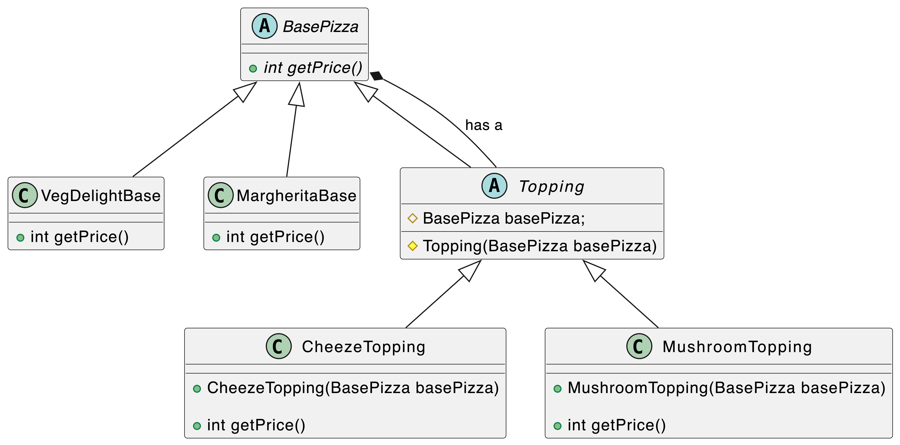

### Decorator Design Pattern

The decorator pattern is a design pattern that allows behavior to be added to an individual object, dynamically, without affecting the behavior of other objects from the same class.

Examples: Pizza base + various toppings, coffee base + various cream/froth, icecream flavours + different sprinklers

In this example we have created two pizza bases - Margherita and VegDelight extending BasePizza abstract class. And we have two toppings - Cheeze and Mushroom extending topping abstract class which further extends basePizza class

