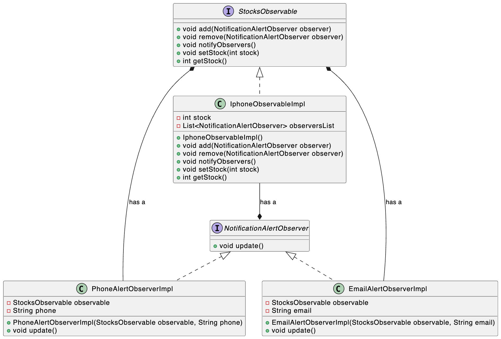

### Observer Design Pattern

When there is some notification service, or pub-sub mechanism, weather forcasting or some subscription service, we use observer design pattern.

In this example, we have an StockObservable interface and a class IphoneObservableImpl which implements that interface. And there are a list of NotificationAlertObserver classes which are subscribed to the StockObservable class. PhoneAlertObserverImpl and EmailAlertObserverImpl are implementation of NotificationAlertObserver interface.

