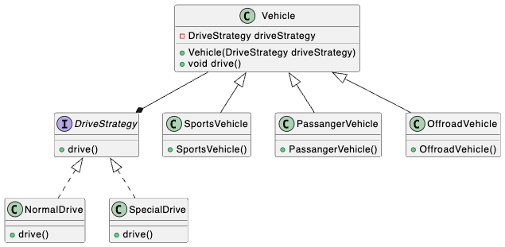

### Strategy Design Pattern

When two or more child classses have same functionalities, implementing those methods in each of them will create lot of duplicate code. So strategy design pattern is use.

In this example, PassangerVehicle use normal drive but Sports and Offroad Vehicle both use the same Special drive. So we create a Drive strategy and pass down the strategy via constuctor injection

